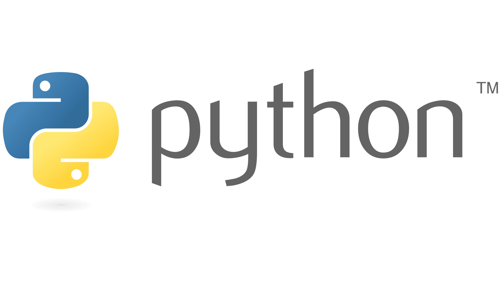
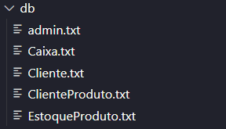

<h1 align="center">
    
</h1>

<h4 align="center"> 
	A FERRAMENTA QUE TRANSFORMARÁ O SEU NEGÓCIO
</h4>


## 🍉 | Sobre o projeto

O frutifica é resultado de uma solicitação feita pelo nosso professor de Lógica de Programação para que lidemos com problemas e soluções reais.

A nossa solução, basicamente, trata de resolver um problema base de qualquer estabelecimento que não tenha acompanhado a "revolução tecnológica". Utilizamos como inspiração um Hortifruti da Zona Rural de Limoeiro de Anadia para entendermos a realidade de um negócio sem a automatização das suas interações, aqui abaixo estão alguns dos requisitos funcionais contidos no nosso projeto:
- Caixa
  	- Para controle de recebimentos
  	- Possibilita a "abertura" e "fechamento" de caixa
  	- Incuída a parte de vendar e emissão de notas
  	- Registro dos clientes em compras
- Seguimento de Clientes 
  	- Para fidelizar os clientes no estabelecimento
  	- Clientes inseridos no banco de dados da empresa
  	- Cumulação de pontos para compras realizadas
- Estoque 
  	- Possibilita o controle das mercadorias
  	- Impede que os produtos venham a perecer
  	- Impede que seja o estoque seja zerado
- Relatórios
  	- Relatórios sobre todos os setores
  	- Exemplos: Cliente mais assíduo e produto mais vendido estarão nos relatórios


Como passado, o nosso público alvo direto são os funcionários e proprietários do Hortifruti e o público alvo indireto são os clientes desse ambiente. Logo, o uso do sistema será diretamente ligados os funcionários que vão usufruitor das funcionalidades.

💻 | O projeto foi desenvolvido pelos estudantes, Ray Antoniel e Ruan Ranison.
Ambos estudantes do 2º Semestre do curso de Sistemas de Informação do IFAL - Campus Arapiraca.


## Linguagem de programação

Toda a aplicação foi desenvolvida em Python

<a>
  
</a>

## ⁉️ | Perguntas e Respostas:

- Quais foram as demandas encontradas no estabelecimento para o projeto?
  	- Basicamente, os estabelecimento que usamos como base utilizava apenas papel para os seus seistemas de informação, sejam eles: estoque, caixa ou até a caderneta com os clientes pendentes. Dessa forma, precisaríamos de uma implementação geral no negócio.
  	
- Quais foram os objetivos traçados para o seu projeto?
  	- Praticidade das relações no estabelecimento
  	- Automatização das atividades
  
- Quais os requisitos desenvolvidos para o seu projeto?
  	- Os requisistos funcionais, foram: Caixa (cuidando da parte de vendas), Seguimento de Clientes (Registro e fidelização dos clientes), Estoque (controle, consulta e manutenção dos produtos em reserva) e Relatórios (informativos relacionados às interações, de modo geral)
  	  
- O que foi atendido pelo seu projeto?
  	- Foram atendidas as demandas de um Hortifruti de pequeno porte. Ou seja, as questões que se relacionam com o dia-a-dia do estabelecimento.
  	  
- Quais e onde foram utilizadas as estruturas no código?

**if/else ou swicth/elif**

```bash
if resposta == "SIM":
            c = open(config("Cliente"), "a")
            c.write("\n"+nome+","+str(idade)+","+cpf+","+numero_telefone+",0")
            c.close()
            print("Cliente cadastrado!")
```

Existem diversos exemplos no decorrer do código. Esse foi extraído do arquivo "cliente.py"

**while/do..while e/ou for**

```bash
for j in cj:
                        cliente = j.replace("\n", "")
                        listaj.append(cliente)
                    cpf_consulta = input('Digite o CPF do cliente para a consulta: ')
                    for j in listaj:
                        if(cpf_consulta == j.split(",")[2]):
                            print("\n\nO preço do produto é: R$"+preco+"\nO valor total da venda é: R$"+str(float(quantidade_venda)*float(preco))+"\n")
                            opcao = input("1 - Confirmar\t2 - Cancelar\n")
```

Assim como outros laços de repetição, esses são bem frequentes. Acima contém um exemplo presente no arquivo "Caixa.py".

**Subprogramas**
```bash
def main():
        LOGIN={"login":"configistrador","senha":"config123"}
        print("\n\n\t\tFRUTIFICA\n\n")
        
        login = input("Login: ")
        senha = input("Senha: ")
        
        if(login == LOGIN['login'] and senha == LOGIN['senha']):
            print("Usuário logado!\n\n\n")
            Main.menu()
        else:
            print("Usuário e/ou senha incorreta!")
            Main.main()
```

Um subprograma é o login como administrador do programa. Está presente em "main.py".

**matrizes/listas**

```bash
lista config
        arquivo = open(config("EstoqueProduto"), "r")
        c = arquivo.readlines()
```

Aqui está um dos exemplos de listas no nosso projeto. Presente no arquivo "EstoqueProduto.py"

**Estruturas**

```bash

25,maracuja,3.0,fruta,5
25,maracuja,3.0,fruta,1
25,maracuja,3.0,fruta,1
25,abacaxi,5.0,fruta,1
25,abacaxi,5.0,fruta,1
25,abacaxi,5.0,fruta,1
25,abacaxi,5.0,fruta,1
25,abacaxi,5.0,fruta,1
25,abacaxi,5.0,fruta,1
25,abacaxi,5.0,fruta,1

```

Aqui está um dos exemplos de estrutura. Presente no arquivo "ClienteProduto.txt".

**cadeia de caracteres/string**
```bash
def cadastrar():
        nome = input('Digite o nome do produto: ')
        quantidade = int(input('Digite a quantidade do produto: '))
        preco = float(input('Digite o valor do produto: R$ '))
        tipo = input('Digite o tipo do produto: ')
```

Aqui está um dos exemplos de cadeia de caracteres/string. Está presente no arquivo "EstoqueProduto.py"


**Arquivos**

```
        c = arquivo.readlines()
```

<a>
  
</a>

Esses são os arquivos onde serão registrados os dados inseridos.


## 🧾 | Aqui estão os Requisitos não-funcionais da aplicação:


- **Requisitos de Produto Final**
  	- Dentro desses requisitos, cumprimos com a **confiabilidade** e a **consistência**. Haja vista que, por ser um sistema de pequena escala, não são levadas em consideração algumas modalidades, como: latência, tempo de execução e até portabilidade. O nosso sistema funciona bem na parte de confiabilidade por assegurar as necessidades do estabelecimento e é consistente por atender as demandas.
- **Requisitos Organizacionais**
  	- O software é compatível com as máquinas do Hortiifruti e a linguagem de programação utilizada (Python) funciona muito bem para a ideia.
- **Requisitos Externos**
  	- A preservação de dados dos clientes está fixa na empresa, pois não lidaremos com a internet na aplicação e o único acesso será condicionado à chave de acesso do administrador.

## ⛲ | Contatos

[Mestres da Web]: [https://nodejs.org/](https://www.mestresdaweb.com.br/tecnologias/requisitos-funcionais-e-nao-funcionais-o-que-sao)
[Logo de Python]: [https://www.typescriptlang.org/](https://logosmarcas.net/python-logo/)

Feito por Ray Antoniel (rass3@aluno.ifal.edu.br) e Ruan Ranison (rrcs1@aluno.ifal.edu.br)
